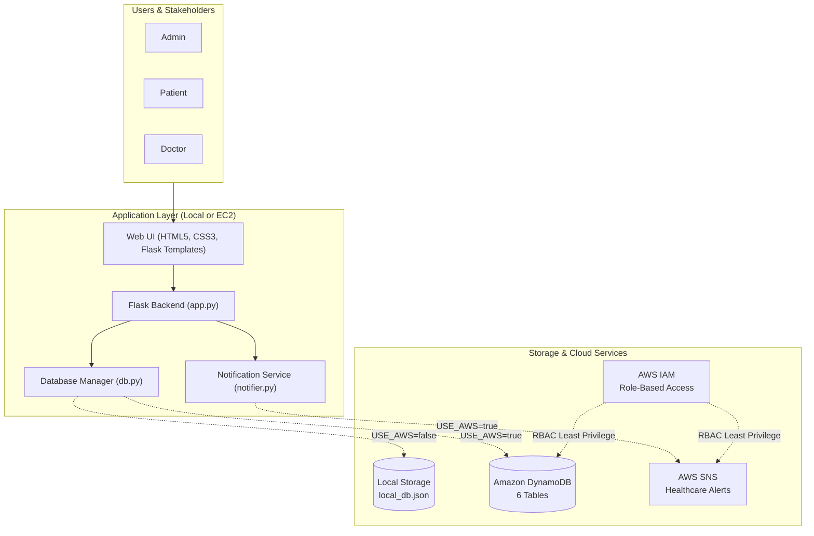
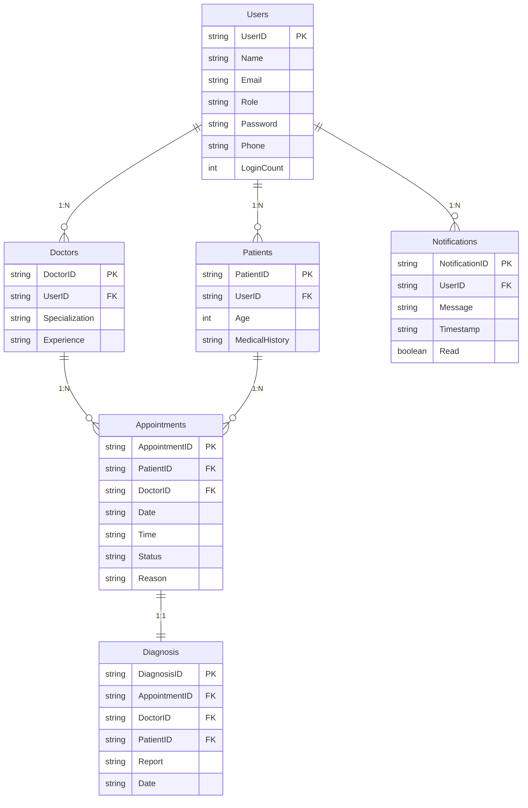

# MedTrack - Cloud-Based Healthcare Management System

MedTrack is a modern healthcare management platform designed to streamline patient-doctor interactions. It centralizes appointment booking, clinical diagnosis submissions, medical history management, and automated notifications.

The application is architected with a **Smart Hybrid Data Layer (Auto-Detection & Fallback)**:
- **Automatic AWS Cloud Detection**: When valid AWS credentials (`AWS_ACCESS_KEY_ID`, `AWS_SECRET_ACCESS_KEY`, or EC2 IAM Role) are detected and DynamoDB is accessible, MedTrack automatically engages AWS DynamoDB and AWS SNS!
- **Zero-Downtime Local Fallback**: If AWS credentials are absent, expired (e.g. Troven Labs 3-hour window ends), or offline, MedTrack automatically and silently falls back to the persistent Local Database (`local_db.json`) with zero crashes or errors!

---

## 🏛️ System Architecture



---

## 📊 Database Entity Model (Image 2)



---

## 🚀 Quick Start (Local Setup)

### 1. Prerequisites
- Python 3.10+
- Installed libraries: `Flask`, `boto3`, `python-dotenv`, `werkzeug`

### 2. Run the Application
Open your terminal in `C:\Users\User\.gemini\antigravity\scratch\medtrack` and start the server:

```bash
python app.py
```

The application will start on:
- **Web Portal**: [http://127.0.0.1:5000](http://127.0.0.1:5000)
- **Health Check Endpoint**: [http://127.0.0.1:5000/health](http://127.0.0.1:5000/health)

---

## 🔑 Pre-Seeded Demo Credentials

The local database comes pre-populated with ready-to-test accounts:

| Portal | Email | Password | Role | Features Accessible |
|---|---|---|---|---|
| **Patient** | `john.doe@gmail.com` | `Patient@123` | Patient | Book appointments, view medical history, search bookings, alerts |
| **Patient** | `emily.watson@gmail.com` | `Patient@123` | Patient | Profile management, view past consultations |
| **Doctor** | `sarah.johnson@medtrack.com` | `Doctor@123` | Doctor (Cardiology) | Clinical schedule, patient records, submit diagnosis |
| **Doctor** | `michael.chen@medtrack.com` | `Doctor@123` | Doctor (Neurology) | Patient history review, diagnose & complete visits |
| **Admin** | `admin@medtrack.com` | `Admin@123` | Administrator | System telemetry, user directory, login counts, audit |

---

## 🧪 Automated Testing

To run the full end-to-end verification test suite:

```bash
python test_app.py
```

This verifies:
1. `/health` API status and configuration
2. User authentication & `LoginCount` telemetry incrementing
3. Patient appointment booking and real-time alerts
4. Multi-parameter appointment searching
5. Doctor diagnosis submission & appointment status completion
6. Profile updates and medical history timeline

---

## ☁️ Transitioning to AWS (Post Troven Access Activation)

When your Troven Labs or AWS account access (3-hour temporary credentials) is activated:

1. **Open `.env`** in `C:\Users\User\.gemini\antigravity\scratch\medtrack\.env`:
   ```ini
   USE_AWS=true
   AWS_DEFAULT_REGION=us-east-1
   AWS_ACCESS_KEY_ID=<Your_Access_Key_ID>
   AWS_SECRET_ACCESS_KEY=<Your_Secret_Access_Key>
   AWS_SESSION_TOKEN=<Your_Session_Token>
   ```

2. **Provision Cloud DynamoDB Tables & SNS Topic**:
   ```bash
   python create_tables.py
   ```
   This will automatically create all 6 DynamoDB tables (`MedTrack_Users`, `MedTrack_Doctors`, etc.) with `PAY_PER_REQUEST` billing mode, and create the SNS topic.

3. **Paste the generated SNS Topic ARN** into `.env`:
   ```ini
   SNS_TOPIC_ARN=arn:aws:sns:us-east-1:123456789012:MedTrack_Healthcare_Alerts
   ```

4. **Restart Flask**:
   ```bash
   python app.py
   ```
   MedTrack will now operate directly against AWS DynamoDB and AWS SNS!

For complete EC2 deployment instructions, Gunicorn & Nginx setup, and IAM role configuration, refer to `AWS_MIGRATION_GUIDE.md`.
